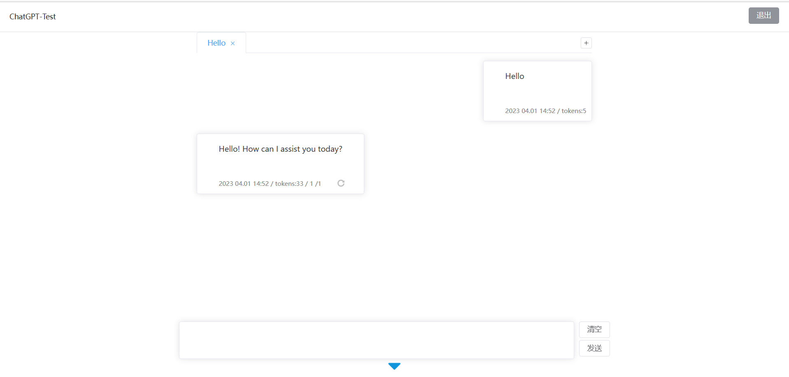

# chatgpt

一个简单的使用OpenAI构建的ChatGPT项目。



首先你确保您的Windows中安装有Node.js

在项目根目录中打开CMD，运行以下命令用于安装项目所需依赖

```
npm install
```

在项目根目录中打开CMD，运行以下命令用于启动服务

```
npm run serve
```

在项目根目录中的conf.js中填入您的OpenAIKey
